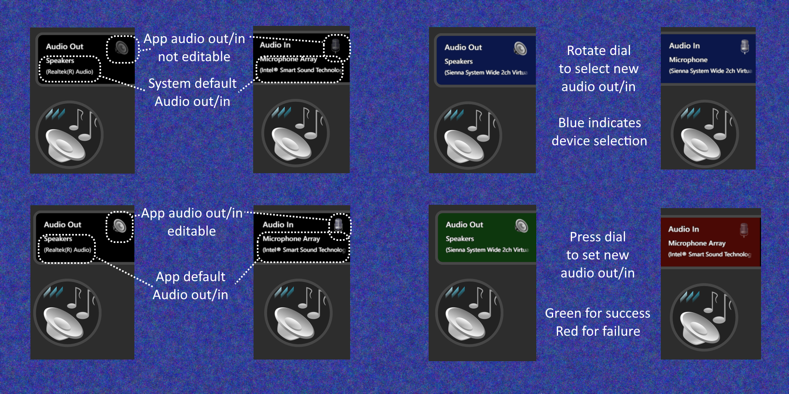
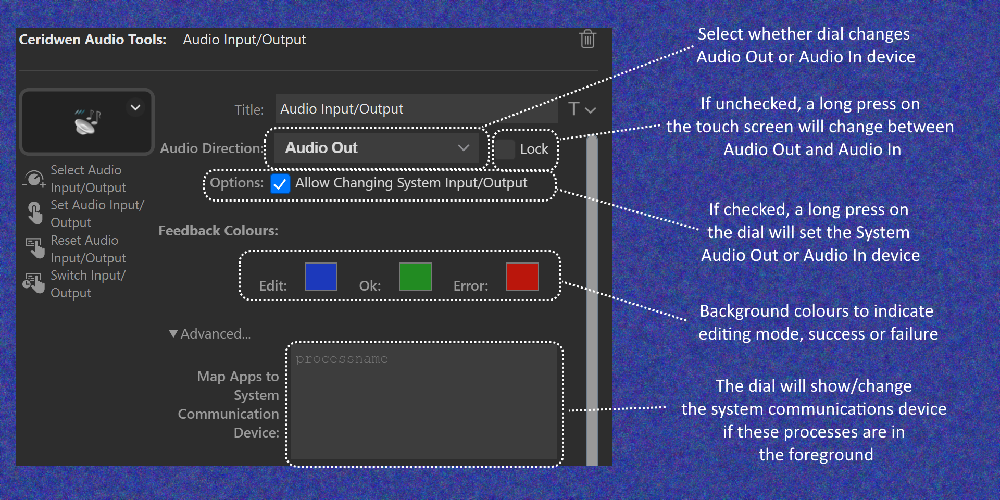

# CeridwenAudioTools
StreamDeck+ plugin for changing the default audio device of the foreground application under Windows 10 and later.

- Displays audio input/output of foreground application
- Allows scrolling through available audio input/output devices
- Allows setting new default input/output of foreground application

### Known Issues
- Application is only configurable if it has opened an audio device (e.g. has played a sound. This is a “feature” of Windows.
- Only works if the application uses the default Windows devices. Some applications link directly to devices without the option of choosing the System Default device (e.g. MS Teams).

### Acknowledgements
- [BarRaider’s Stream Deck Tools](https://github.com/BarRaider/streamdeck-tools)
- [EarTrumpet](https://github.com/File-New-Project/EarTrumpet)
